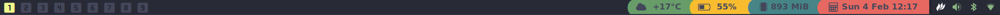

# NimdowStatus
A Simple Status For Nimdow Window Manager
https://github.com/avahe-kellenberger/nimdow

## Screenshot




## Installation
install font awesome for the icons. most distrobutions have this package in their repo.

### Clone Repo
```bash
git clone https://gitlab.com/DrunkenAlcoholic/nimdowstatus.git ~/.config/nimdow/nimdowstatus
```

### Compile
```bash
cd ~/.config/nimdow/nimdowstatus
nimble build -d:ssl
```
Or for some performance improvements you can enable some compiler flags, -d:ssl flag is need for the weather, using nimble with the release argument will include -d:ssl

```bash
cd ~/.config/nimdow/nimdowstatus
nimble release
```

### Config Nimdow

You will need to update Nimdow config.toml located in ~/.config/nimdow

add the status bar tot he autostart section of the config
```toml
[autostart]
exec = [
  "xsetroot -cursor_name left_ptr",
  "~/.config/nimdow/nimdowstatus/NimdowStatus"
]
```

add the font to the setting
```toml
barFonts = [
    "FontAwesome:size=14:antialias=true",
  ]
```

below is an example Config with a gruvbox type theme and nerd font icons for the tags

```toml
# App Rules
# Example:
# [[appRule]]
# class = "st"
# instance = "st"
# title = "st"
# monitor = 1
# tags = [ 1, 4, 7 ]
# state = "floating" # normal, floating, and fullscreen are all valid.

# Start external programs
[[startProcess]]
command = "pkill nimdow"
keys = [ "Delete" ]
modifiers = [ "control", "alt" ]

[[startProcess]]
command = "$BROWSER"
keys = [ "i" ]
modifiers = [ "super" ]

[[startProcess]]
command = "dmenu_run"
keys = [ "p" ]
modifiers = [ "control", "super" ]

[[startProcess]]
command = "rofi -show drun"
keys = [ "p" ]
modifiers = [ "super" ]

[[startProcess]]
command = "alacritty"
keys = [ "Return" ]
modifiers = [ "super" ]

# Example: Start process when region is clicked, see github wiki for what constitutes a region
# [[startProcess]]
# command = "notify-send \"Id: %1, rx: %2, cx: %4, w: %6\""
# clickRegion = 0

[autostart]
exec = [
  "xsetroot -cursor_name left_ptr",
  "~/.config/nimdow/nimdowstatus/NimdowStatus"
  "~/.config/nimdow/start-picom.sh",
  "/usr/lib/polkit-gnome/polkit-gnome-authentication-agent-1",
  "nitrogen --restore",
  "nm-applet",
  "volumeicon",
  "blueberry-tray",
  #"firefox",
  #"st",
]

[settings]
  # Window settings - gruvboxish type theme
  borderWidth = 1
  borderColorUnfocused = "#282a36"
  borderColorFocused = "#8ec07c"
  borderColorUrgent = "#cc241d"
  # Bar settings
  barHeight = 28
  windowTitlePosition = "center"
  barBackgroundColor = "#918273" #"#282a36"
  barForegroundColor = "#313338" #"#f8f8f2"
  barSelectionColor = "ebdbb2"#"#f9bc2f" #"#50fa7b"
  barUrgentColor = "#cc241d"
  barFonts = [
    "DejaVu Sans:style=Bold:size=12:antialias=true",
    "FontAwesome:size=14:antialias=true",
    "JetBrainsMono Nerd Font:size=20:antialias=true",
  ]
  # Layout settings
  gapSize = 12
  outerGap = 0
  resizeStep = 10
  # Scratchpad settings
  scratchpadWidth = 500
  scratchpadHeight = 300
  # General settings
  loggingEnabled = false
  reverseTagScrolling = false
  # The key used for moving and resizing windows.
  # All options: "control", "shift", "alt", "super", "caps lock", "mod1", "mod2", "mod3", "mod4", "mod5"
  # alt is an alias for Mod1Mask,
  # super is an alias for Mod4Mask
  # See keyutils.nim for details
  modKey = "super"

# Window manager controls
[controls]
  [controls.reloadConfig]
  keys = [ "r" ]
  modifiers = [ "super", "shift" ]

  [controls.focusPrevious]
  keys = [ "k" ]
  modifiers = [ "super" ]

  [controls.focusNext]
  keys = [ "j" ]
  modifiers = [ "super" ]

  [controls.moveWindowPrevious]
  keys = [ "k" ]
  modifiers = [ "super", "shift" ]

  [controls.moveWindowNext]
  keys = [ "j" ]
  modifiers = [ "super", "shift" ]

  [controls.toggleFullscreen]
  keys = [ "f" ]
  modifiers = [ "super" ]

  [controls.destroySelectedWindow]
  keys = [ "q" ]
  modifiers = [ "super", "shift" ]

  [controls.goToPreviousTag]
  keys = [ "w" ]
  modifiers = [ "super" ]

  [controls.moveWindowToPreviousTag]
  keys = [ "w" ]
  modifiers = [ "super", "shift" ]

  [controls.focusPreviousMonitor]
  keys = [ "comma" ]
  modifiers = [ "super" ]

  [controls.focusNextMonitor]
  keys = [ "period" ]
  modifiers = [ "super" ]

  [controls.moveWindowToPreviousMonitor]
  keys = [ "comma" ]
  modifiers = [ "super", "shift" ]

  [controls.moveWindowToNextMonitor]
  keys = [ "period" ]
  modifiers = [ "super", "shift" ]

  [controls.increaseMasterCount]
  keys = [ "z" ]
  modifiers = [ "super" ]

  [controls.decreaseMasterCount]
  keys = [ "x" ]
  modifiers = [ "super" ]

  [controls.toggleFloating]
  keys = [ "space" ]
  modifiers = [ "super" ]

  [controls.jumpToUrgentWindow]
  keys = [ "u" ]
  modifiers = [ "super" ]

  [controls.goToTag]
  keys = [ "1", "2", "3", "4", "5", "6", "7", "8", "9" ]
  modifiers = [ "super" ]

  [controls.goToLeftTag]
  keys = [ "Left" ]
  modifiers = [ "super" ]

  [controls.goToRightTag]
  keys = [ "Right" ]
  modifiers = [ "super" ]

  [controls.moveWindowToTag]
  keys = [ "1", "2", "3", "4", "5", "6", "7", "8", "9" ]
  modifiers = [ "super", "shift" ]

  [controls.moveWindowToLeftTag]
  keys = [ "Left" ]
  modifiers = [ "super", "shift" ]

  [controls.moveWindowToRightTag]
  keys = [ "Right" ]
  modifiers = [ "super", "shift" ]

  [controls.toggleTagView]
  keys = [ "1", "2", "3", "4", "5", "6", "7", "8", "9" ]
  modifiers = [ "super", "control" ]

  [controls.toggleWindowTag]
  keys = [ "1", "2", "3", "4", "5", "6", "7", "8", "9" ]
  modifiers = [ "super", "shift", "control" ]

	[controls.increaseMasterWidth]
	keys = [ "l" ]
	modifiers = [ "super" ]

	[controls.decreaseMasterWidth]
	keys = [ "h" ]
	modifiers = [ "super" ]

  [controls.moveWindowToScratchpad]
  keys = [ "s" ]
  modifiers = [ "super", "shift" ]

  [controls.popScratchpad]
  keys = [ "s" ]
  modifiers = [ "super" ]

  [controls.rotateClients]
  keys = [ "r" ]
  modifiers = [ "super" ]

  [controls.toggleStatusBar]
  keys = [ "b" ]
  modifiers = [ "super" ]

# Example monitor settings:
 [monitors]
   [monitors.default.tags]
   1.displayString = "󰎤"
   2.displayString = "󰎧"
   3.displayString = "󰎪"
   4.displayString = "󰎭"
   5.displayString = "󰎱"
   6.displayString = "󰎳"
   7.displayString = "󰎶"
   8.displayString = "󰎹"
   9.displayString = "󰎼"
  # Set the number of master windows for ALL monitors.
  # all.numMasterWindows = 2
  # all.defaultMasterWidthPercentage = 60

  # [monitors.1.tags]
  # 2.displayString = "two"
  # Set the number of master windows per-monitor.
  # all.numMasterWindows = 3
  # Set the number of master windows per-tag.
  # 2.numMasterWindows = 1

  # [monitors.2.tags]
  # 2.displayString = "too"
```
